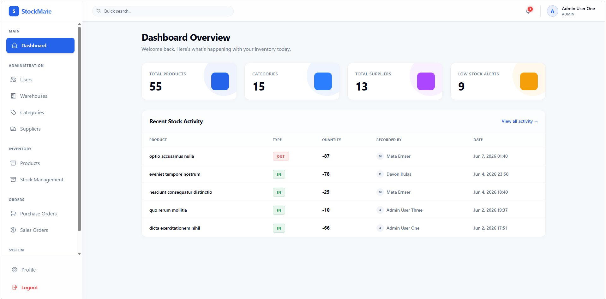

# StockMate — Inventory Management System

A fully-featured inventory management REST API built with Laravel 13. Designed for
small to mid-size trading businesses managing products, stock, warehouses, suppliers,
purchase orders, and sales — including online payment via SSLCommerz.

This is a backend-focused project. A companion React frontend is available for
visual demonstration. Both are live and running.

---

## Live Demo

| | URL |
|---|---|
| **Frontend** | [stockmate-demo.vercel.app](https://stockmate-demo.vercel.app) |
| **Backend API** | [stockmate-pq66.onrender.com](https://stockmate-pq66.onrender.com) |
| **API Docs** | [stockmate-pq66.onrender.com/docs/api](https://stockmate-pq66.onrender.com/docs/api) |

> The database is pre-seeded with realistic dummy data — products, warehouses,
> suppliers, purchase orders, sales, and stock history — so it feels like an
> already running business, not an empty demo.

**Demo credentials:**

| Role | Email | Password |
|---|---|---|
| Admin | admin@example.com | password |
| Staff | staff@example.com | password |

---

## Tech Stack

- **Framework** — Laravel 13
- **Authentication** — Laravel Sanctum + Laravel Fortify (API mode)
- **Database** — MySQL
- **Caching** — Redis (via Laravel Cache with tags, observers, and flexible TTL)
- **Payment Gateway** — SSLCommerz (`sslcommerz/sslcommerz-laravel`)
- **Excel / CSV Export** — Maatwebsite Laravel Excel
- **Activity Logging** — Spatie Laravel Activity Log
- **API Documentation** — Scribe

---

## Features

**Authentication & Users**
- Token-based authentication via Sanctum
- Two roles: Admin and Staff with middleware-level route protection
- No public registration — accounts created by admin only
- User activation and deactivation

**Product Management**
- Products with categories, suppliers, SKU, pricing, and image upload
- Full CRUD with role-based access control

**Multi-Warehouse Stock**
- Stock tracked per product per warehouse — not globally
- Stock in, stock out, and inter-warehouse transfers
- Every movement logged with user, timestamp, and note
- Low stock alerts via email when quantity drops below reorder threshold

**Purchase Orders**
- Full PO lifecycle: draft → ordered → partially received → received → cancelled
- Partial receiving supported — stock updates incrementally per receipt
- Stock only updates on receive, never on order creation

**Sales Orders + SSLCommerz Payment**
- Sales orders with line items and customer details
- SSLCommerz payment initiation and server-side callback handling
- Stock only decrements on confirmed, validated payment success
- Full payment payload stored for audit trail

**Reports**
- Stock summary per product with low stock status
- Stock movement report by date range
- Low stock report across all warehouses
- Export to CSV or Excel

**Activity Log**
- Full audit trail of every action — who did what and when
- Filterable by user and date range, admin only

**Redis Caching**
- Dashboard metrics cached at 5 minute TTL — eliminates 4–5 queries per load
- Reference data (categories, suppliers) cached at 1 hour TTL
- Product listings, warehouse stock, order lists, and stock logs cached with
  flexible TTL using stale-while-revalidate strategy
- Historical export queries cached at 24 hours
- Cache auto-invalidated via Model Observers on every create, update, or delete
- Cache tags used for grouped invalidation across related endpoints
- Cache stampede prevention using `Cache::lock()` on high-traffic endpoints

---

## API Documentation

This project uses [Scribe](https://scribe.knuckles.wtf/laravel/) for automatic API
documentation. All endpoints, request bodies, response shapes, and authentication
requirements are documented and always in sync with the code.

**Live docs:** [stockmate-pq66.onrender.com/docs](https://stockmate-api-7i6e.onrender.com/docs)

Alternatively, the [frontend](https://stockmate-demo.vercel.app) covers the core flows
visually if you prefer to explore that way.

---

## Frontend

**[stockmate-demo.vercel.app](https://stockmate-demo.vercel.app)**
— React, connects to the live API

> **Note:** The frontend is fully vibe coded and covers approximately 50% of the API's capabilities and
> exists purely for visual demonstration. Core flows — login, dashboard, product
> management, stock in/out, and purchase orders — are functional. Advanced features
> such as filtering, report exports, stock transfers, and sales order payment flow
> are best explored through the API docs.
>
> This is a backend-focused project. The frontend is there to show the system
> working, not to be a complete production UI.

Frontend source: [github.com/HasanAshab/stockmate-frontend](https://github.com/HasanAshab/stockmate-frontend)

---

## Local Setup

### Requirements

- PHP 8.3+
- Composer
- MySQL 8+
- Redis

### Steps

**1. Clone the repository**

```bash
git clone https://github.com/HasanAshab/stockmate.git
cd stockmate
```

**2. Install dependencies**

```bash
composer install
```

**3. Environment setup**

```bash
cp .env.example .env
php artisan key:generate
```

Open `.env` and configure:

```env
# Database
DB_DATABASE=stockmate
DB_USERNAME=root
DB_PASSWORD=

# Cache — Redis
CACHE_STORE=redis
REDIS_HOST=127.0.0.1
REDIS_PORT=6379
REDIS_CACHE_DB=1

# Mail (Mailtrap for local testing)
MAIL_MAILER=smtp
MAIL_HOST=sandbox.smtp.mailtrap.io
MAIL_PORT=2525
MAIL_USERNAME=your_mailtrap_username
MAIL_PASSWORD=your_mailtrap_password
MAIL_FROM_ADDRESS=admin@stockmate.test

# SSLCommerz
SSLCOMMERZ_STORE_ID=your_store_id
SSLCOMMERZ_STORE_PASSWORD=your_store_password
SSLCOMMERZ_SANDBOX_MODE=true
```

**4. Run migrations and seed**

```bash
php artisan migrate --seed
```

Seeds the database with realistic dummy data across all modules — products,
warehouses, suppliers, stock history, purchase orders, and sales orders.
Includes one admin and one staff account ready to use.

**5. Storage link**

```bash
php artisan storage:link
```

**6. Start the server**

```bash
php artisan serve
```

API: `http://localhost:8000/api`
API Docs: `http://localhost:8000/docs/api`

---

## Default Accounts (After Seeding)

| Role | Email | Password |
|---|---|---|
| Admin | admin@example.com | password |
| Staff | staff@example.com | password |

---

## Database Design

| Table | Purpose |
|---|---|
| `users` | Admin and staff accounts with role and active status |
| `categories` | Product categories |
| `suppliers` | Supplier details linked to products |
| `products` | Product catalog with SKU, pricing, image, and links |
| `warehouses` | Physical warehouse locations |
| `warehouse_stock` | Stock quantity per product per warehouse |
| `stock_logs` | Full history of every stock movement |
| `purchase_orders` | Orders raised to suppliers |
| `purchase_order_items` | Line items per purchase order |
| `sales_orders` | Customer sales with payment status |
| `sales_order_items` | Line items per sales order |
| `activity_log` | System-wide audit trail (Spatie) |
| `personal_access_tokens` | Sanctum API tokens |

---

## Coming Soon

These features are planned for a future version:

- **Login with Phone or Email** — Support both Phone number and Email to login
- **SMS / WhatsApp Notifications** — Low stock and order alerts via SMS alongside
  email, using a Bangladesh-compatible gateway
- **Barcode Label Printing** — Generate and print barcodes directly from the
  product management panel
- **Customer Portal** — A separate login for customers to track their own sales
  orders and payment history
- **Advanced Analytics** — Charts and trends for stock movement, top-selling
  products, supplier performance, and warehouse utilization over time
- **Multi-Currency Support** — Record purchase costs and sales prices in multiple
  currencies with a base currency conversion
- **Custom Role Builder** — Let admins define granular permissions per user instead
  of fixed admin/staff roles
- **Mobile App** — The API is already mobile-ready with full Sanctum token support.
  A React Native or Flutter app is the natural next step.
- **Audit Log Export** — Export the full activity log as CSV or PDF for compliance
  and accounting purposes

### AI-Powered Features

* **Demand Forecasting** — Predict future stock demand using historical sales,
  seasonal trends, and warehouse movement patterns

* **Smart Reorder Recommendations** — Automatically suggest purchase orders based
  on low stock thresholds, sales velocity, and supplier lead times

* **Purchase Insights** — Detect unusually expensive supplier pricing and suggest
  better purchasing decisions from historical data

* **Natural Language Dashboard Queries** — Ask questions like:
  *“Which products are running out fastest?”* or
  *“Show warehouses with dead stock older than 90 days”*

* **Sales Anomaly Detection** — Detect suspicious sales spikes, duplicate orders,
  or abnormal warehouse stock movements automatically

* **Invoice & Receipt OCR** — Upload supplier invoices or receipts and automatically
  extract products, quantities, prices, and totals into purchase orders

* **Product Auto-Categorization** — Automatically categorize products from title,
  description, or supplier data

* **Supplier Performance Scoring** — Evaluate suppliers based on delivery speed,
  stock quality, pricing consistency, and cancellation rate

* **Predictive Low Stock Alerts** — Instead of alerting only after stock becomes low,
  forecast when inventory will likely run out

* **Assistant for Admins** — An internal assistant capable of summarizing reports,
  generating operational insights, and helping staff navigate the system faster

---

## Project Background

This project was built as a portfolio piece to demonstrate backend development
skills in Laravel. The scope was chosen to reflect real-world software that
businesses in Dhaka's trading sector actually use — inventory trackers, supplier
management tools, and payment-integrated sales systems.

Features were prioritised in this order: core stock management → multi-warehouse →
purchase orders → sales with payment → caching and performance. Each feature is
production-minded — operations are wrapped in DB transactions, stock can never go
negative, every movement is fully auditable, and frequently-hit endpoints are
cached in Redis to reduce database load by up to 85%.

---

## License

MIT